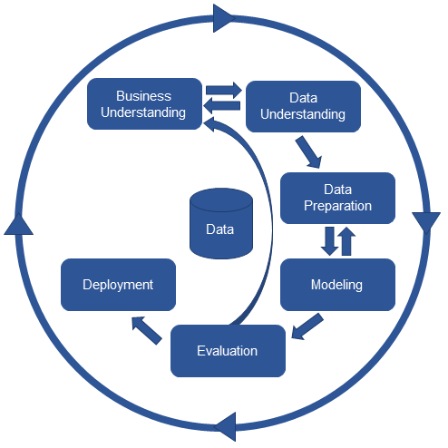
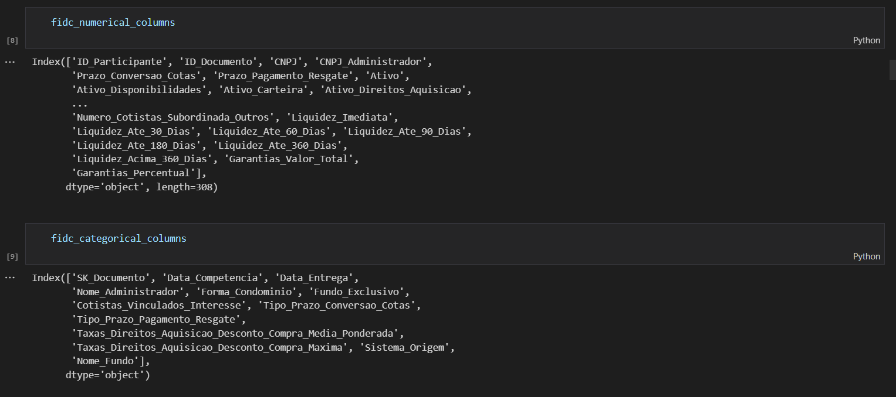
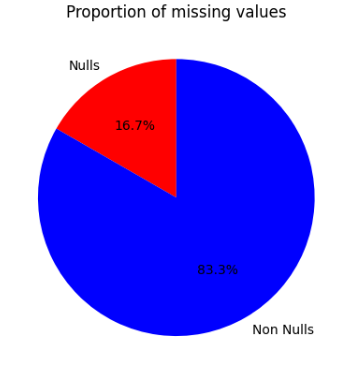

# Documentação Modelo Preditivo - Inteli

## AsiModel
### Asimov
#### Davi Arantes, Gabriel de Macedo Santos, Gustavo Gouveia, Henrique Ottoboni, Hugo Noyma, Rafael Coutinho

## Sumário
[1. Introdução](#c1)

[2. Objetivos e Justificativa](#c2)

[3. Metodologia](#c3)

[4. Desenvolvimento e Resultados](#c4)

[5. Conclusões e Recomendações](#c5)

[6. Referências](#c6)

[Anexos](#attachments)

## 1. Introdução

&emsp;&emsp;Para este módulo, o parceiro de negócio é a CVM (Comissão de Valores Imobiliários), uma autarquia federal vinculada ao Ministério da Economia no Brasil, cuja principal função é regular e fiscalizar o mercado de valores mobiliários no país. A CVM atua na regulação e normatização, garantindo transparência, integridade e eficiência do mercado; na fiscalização e supervisão, proteção ao investidor, fomento do desenvolvimento do mercado e aplicação de penalidades quando ocorrem infrações às normase regulamentos do mercado. E, nestas 10 semanas de desenvolvimento, trabalharemos com os FIDCs (Fundos de Investimento de Direitos Creditórios), que será explicado melhor ao longo da documentação.

## 2. Objetivos e Justificativa
### 2.1 Objetivos
&emsp;&emsp;Em parceria com o Inteli, a CVM busca sanar uma dor que é a falta de previsão de quebra financeira de um FIDC, ou seja, sendo um Fundo de Investimento em Direitos Creditórios, ele pode quebrar ou enfrentar dificuldades financeiras por várias razões, assim como qualquer outro veículo de investimento. Quando um FIDC enfrenta sérios problemas, isso geralmente resulta na deterioração do valor das cotas do fundo, o que pode impactar negativamente os investidores. Um FIDC, então, pode enfrentar dificuldades financeiras devido à inadimplência dos devedores, má gestão do fundo, recessão econômica, má avaliação de riscos, entre outros. Desse modo, o principal objetivo deste projeto é de certa forma prever a quebra financeira de um FIDC.

### 2.2 Proposta de solução
&emsp;&emsp;O modelo preditivo usa aprendizado de máquina para prever o desempenho de Fundos de Investimento em Direitos Creditórios (FIDCs), com o objetivo de orientar decisões informadas. Inicia-se com a coleta de dados históricos dos FIDCs, seguida pela preparação e engenharia desses dados, incluindo a criação de novas variáveis. A seleção do algoritmo apropriado, como regressão ou redes neurais, é feita considerando a complexidade dos dados.

&emsp;&emsp;O modelo é treinado e validado, usando conjuntos de dados distintos para evitar excesso de ajuste. A interpretação das previsões destaca as variáveis mais influentes, proporcionando transparência.

&emsp;&emsp;Finalmente, o modelo é implantado em um ambiente de produção, sendo monitorado e atualizado conforme necessário. Em resumo, o modelo oferece previsões de desempenho de FIDCs por meio de aprendizado de máquina, facilitando decisões de investimento embasadas desde a coleta e preparação de dados até a interpretação e uso contínuo.

### 2.3 Justificativa
&emsp;&emsp;A proposta inovadora de utilização de aprendizado de máquina para prever o desempenho de Fundos de Investimento em Direitos Creditórios (FIDCs) oferece vantagens significativas. Ao incorporar uma ampla gama de variáveis, incluindo métricas de risco e indicadores econômicos, o modelo apresenta potencial para previsões mais precisas e informadas. Isso beneficia  os analistas da CVM, permitindo decisões embasadas, otimização de estratégias e insights profundos sobre os fatores que influenciam o desempenho dos FIDCs.

&emsp;&emsp;A abordagem completa, que abrange desde a coleta de dados até a interpretação transparente das previsões e implantação contínua, distingue essa solução. Ao considerar a complexidade dos dados de maneira dinâmica e incluir variáveis macroeconômicas, ela se diferencia das abordagens convencionais. Em resumo, a proposta se destaca por sua aplicação avançada de aprendizado de máquina, promovendo previsões mais acuradas e decisões mais embasadas para os atores do mercado financeiro.

## 3. Metodologia

&emsp;&emsp;A princípio, CRISP-DM é um acrônimo para cross industry standard process for data mining. Se trata de uma metodologia ágil que fornece uma abordagem estruturada e robusta para o planejamento de projetos envolvendo machine learning, mineração e análise de dados.

&emsp;&emsp;O método funciona de forma cíclica, pois quando o projeto envolve muitos dados, informações e variáveis, não é possível ter a percepção completa do que irá ocorrer no final do desenvolvimento da aplicação. A partir disso, é necessário um processo que faça explorações etapa a etapa e que seja capaz de retornar aos estágios anteriores sempre que necessário.

Figura 1 - CRISP-DM

Autoria: Asimov

&emsp;&emsp;O principal diferencial do CRISP em relação às outras metodologias está justamente na “conversa” que os estágios têm entre si.  Por exemplo, se durante o estágio de _modeling_ (modelagem), o analista de dados perceber que os dados presentes não são suficientes para resolver o problema, a equipe pode retornar ao estágio de _data preparation_ (preparação de dados) e selecionar novas variáveis a serem trabalhadas, de tal forma que não seja necessário retornar ao estágio inicial do processo.

Como mencionado, o CRISP-DM funciona através de etapas. A seguir, uma explicação de cada etapa: 
1. _Entendendo o negócio_: Definir objetivos, metas, impedimentos, riscos, aplicações e custos
2. _Entendendo os dados_: Coleta, exploração e mineração dos dados
3. _Preparando os dados_: Escolha correta de quais dados serão usados. inclui os passos: 
	1. __Seleção__: Selecionar os dados mais relevantes 
	2. __Limpeza__: Verificar dados corrompidos e excluí-los 
	3. __Construção dos dados__: Construção de novos  conjuntos de dados a partir de um dado original
	4. __Integração dos dados__: Unir ou mesclar os dados para que tenha algo ainda mais consistente que irá contribuir para o estágio de modelagem
4. _Modelagem_: Seleção do algoritmo, definir planos de teste para validação, construir o modelo e avaliar nessa modelagem 
5. _Avaliação_: Avaliar a qualidade 
6. _Implantação_: Colocar os modelos em produção. os objetivos são os seguintes: 
	1. Planejamento da deploy; implantação do software 
	2. Monitoramento e manutenção 
	3. Gerar relatórios; documentar todos os processos e resultados 
	4. Avaliar os resultados finais

Podemos enumerar diversas vantagens que dizem respeito a essa metodologia, como por exemplo: 

- **Resolução de problemas:** A metodologia oferece respostas precisas para a resolução de problemas.
- **Análise em tempo real:** A metodologia permite que haja mudanças imediatas durante o processo. à medida que o cenário vai mudando e novas probabilidades surgem, contar com um processo incremental e que pode ser alterado a qualquer momento, pode ser bem útil. 
- **Relacionamento com o cliente:** Uma das etapas primordiais engloba o entendimento do negócio, atendendo os objetivos do cliente.isso irá contribuir para que o cliente se sinta mais seguro e confortável para possíveis negociações futuras. 
- **Decisões e resultados mais inteligentes e eficazes:** Saber trabalhar com dados garante vantagem competitiva e resultados promissores.
- **Pode ser aplicado em qualquer área:** Independente do ramo da indústria da sua empresa, trabalhar com dados irá contribuir para o sucesso dos seus negócios. a metodologia pode ser aplicada para análises  de dados financeiros, comerciais, de marketing, de recursos humanos, de produção e etc.  
- **Tomada de decisão orientada a dados:** Isso é uma vantagem excepcional que falaremos um pouquinho melhor no bônus a seguir.

## 4. Desenvolvimento e Resultados
### 4.1. Compreensão do Problema
#### 4.1.1. Contexto da indústria 

&emsp;&emsp;Os Fundos de Investimento em Direitos Creditórios (FIDCs) são fundos de investimento que têm como principal ativo carteiras de direitos creditórios, que são recebíveis gerados por diversos tipos de créditos concedidos a terceiros. Esses créditos podem ser originados por consórcios, empréstimos pessoais, contas de energia elétrica, vendas a prazo no varejo, entre outros. Ao adquirir esses direitos creditórios, o FIDC se torna o detentor dos recebíveis (direitos creditórios) e recebe os pagamentos devidos pelos sacados (devedores).

&emsp;&emsp;Nesse mercado a ocorrência de insuficiência ou ausência de provisão para eventuais perdas é frequente, podendo gerar falências e a cobrança de um valor adicional para os investidores. Esse problema pode ocorrer devido à inadimplência dos créditos cedidos pelos cedentes (vendedores) aos FIDCs. Quando o administrador do FIDC não faz uma provisão adequada para as perdas, pode haver uma transferência de riqueza entre cotistas, onde aqueles que resgatam suas cotas antes da ocorrência de perdas elevadas obtêm maior rentabilidade em comparação com aqueles que permanecem no fundo e experimentam a desvalorização de suas cotas.

&emsp;&emsp;Como forma de resolver o problema acima, foi realizado o desenvolvimento de um modelo preditivo capaz de prever a saúde e a chance de ocorrência de problemas relacionados à insuficiência ou ausência de provisão para eventuais perdas dos FIDCs, o que pode, consequentemente, gerar um efeito borboleta nesse mercado de crédito, ocasionando dívidas tanto para investidores, quanto para empresas.

&emsp;&emsp;O modelo será utilizado pelos analistas da Superintendência de Supervisão de Securitização (SSE) da Comissão de Valores Mobiliários (CVM) e utilizará técnicas de análise preditiva, baseadas em aprendizado de máquina (Machine Learning), para analisar os dados dos FIDCs ativos, levando em consideração fatores como a concentração de cedentes, recompras e substituições de créditos, renegociações e o ramo de atividade econômica dos créditos cedidos. Com base nessas informações e no Valor em Risco (VR) dos créditos do fundo, o modelo irá avaliar se a provisão é adequada para cobrir a inadimplência ocorrida nos créditos.

&emsp;&emsp;A solução será entregue no Jupyter Notebook, facilitando a visualização dos resultados e permitindo uma análise mais detalhada dos fundos. O modelo será atualizado mensalmente com base nos novos Informes Mensais (IMs) dos FIDCs, permitindo a detecção contínua e proativa de riscos e problemas potenciais.

&emsp;&emsp;A CVM e seus analistas se beneficiarão diretamente da solução. Através de uma automatização na supervisão, a qual ocorria manualmente, e na identificação de padrões em FIDCs, o trabalho será mais eficiente e prático. Ademais, ocorrerá uma mitigação de riscos e um aumento no depósito de confiança por parte do mercado financeiro nesse setor, visto que a CVM poderá identificar e atuar antecipadamente sob os FIDCs com saúde em risco,  o que consequentemente, pode evitar a perda de dinheiro de investidores, falência de fundos e crises econômicas.

&emsp;&emsp;A acurácia alcançada pelo modelo preditivo na identificação dos FIDCs com maior probabilidade de enfrentar insuficiência ou falta de provisão para perdas em seus créditos é o que irá determinar o sucesso do projeto. A partir disso, ela será fundamentada em uma análise de matriz de confusão, permitindo calcular a proporção de falsos positivos e falsos negativos.

#### 4.1.2. Análise SWOT 

Figura 2 - SWOT

Autoria: Asimov

&emsp;&emsp;A análise conhecida como SWOT, ou FOFA, é uma ferramenta estratégica empregada para a avaliação dos recursos internos e do ambiente externo nos quais uma organização opera. Ela é representada pelo acrônimo que abarca Forças (Strengths), Fraquezas (Weaknesses), Oportunidades (Opportunities) e Ameaças (Threats). Esta avaliação desempenha um papel de suma importância, segundo a Comissão de Valores Mobiliários, ao propiciar a compreensão primordial das principais forças e oportunidades que sustentarão a execução do projeto. De forma simultânea, as fraquezas e ameaças consistem em informações de relevância crítica, facultando à nova instituição de ensino a prevenção e a mitigação de potenciais complicações no porvir empresarial, enquanto as suplanta por meio de estratégias cuidadosamente delineadas.

#### 4.1.3. 5 Forças de Porter

Figura 3 - 5 Forças de Porter

Autoria: Asimov

&emsp;&emsp;A análise das 5 Forças de Porter permite mapear o mercado para fortalecer o planejamento e a tomada de decisão de uma empresa pra entrar em um mercado, realizar um projeto estrategicamente ou avaliar suas condições atuais em relação ao setor como um todo. Ela é baseada em fatos e análises sistemáticas do mercado, com ênfase nos fatores referentes à competitividade. Todas as 5 forças de Porter são capazes de afetar a lucratividade de um negócio de acordo com o nível de poder que possuem no setor. Elas são: Concorrentes, Forncedores, Clientes, Novos entrantes e substitutos. A seguir uma análise destas forças no contexto da empresa parceira CVM

&emsp;&emsp;A primeira força é representada pelos concorrentes atuais, sendo que a Comissão de Valores Mobiliários, enquanto autarquia brasileira, não enfrenta concorrência dentro do mercado nacional.

&emsp;&emsp;A principal ameaça identificada para a Comissão de Valores Mobiliários consiste no aumento de investidores direcionando seus recursos para fundos offshores, o que pode resultar no abandono do mercado brasileiro. Isso ocorre devido à perspectiva de maiores retornos financeiros e maior segurança, visto que os recursos estariam fora do Brasil. Por esse motivo, acredita-se que a Comissão de Valores Mobiliários desempenhe um papel fundamental na mitigação desse risco.

&emsp;&emsp;A segunda força, denominada Concorrentes Potenciais, envolve a análise das empresas que poderiam ingressar e prosperar no mercado. Esses potenciais concorrentes são empresas de pequeno e médio porte que já são conhecidas, mas ainda não alcançaram um nível significativo de crescimento e competitividade. Dado que a Comissão de Valores Mobiliários é uma autarquia, tal conceito não se aplica a ela.

&emsp;&emsp;A terceira força diz respeito aos produtos que poderiam substituir o modelo adotado pela Comissão de Valores Mobiliários.

&emsp;&emsp;A quarta força relaciona-se aos fornecedores que colaboram para a prestação dos serviços da empresa. Esses fornecedores incluem corretoras, fundos de investimento, entre outros, que auxiliam a Comissão de Valores Mobiliários na supervisão dos ativos e na mitigação de riscos para os investidores. Como órgão regulador, a Comissão de Valores Mobiliários detém considerável poder de negociação em relação aos seus fornecedores.

&emsp;&emsp;A quinta força abrange os clientes atendidos pela Comissão de Valores Mobiliários. Dado que a entidade abrange todos os âmbitos do mercado mobiliário e atua como órgão regulador, ela possui substancial poder de negociação em relação aos seus fornecedores.

#### 4.1.4. Planejamento Geral da Solução
a) Dados Disponíveis:

&emsp;&emsp;Os dados utilizados neste projeto foram obtidos a partir dos informes mensais dos Fundos de Investimentos de Direitos Creditórios (FIDCs), fornecidos pela Comissão de Valores Mobiliários (CVM). Estes informes contêm uma variedade de informações cruciais relacionadas aos FIDCs, incluindo detalhes sobre os ativos, suas performances, taxas de juros, ratings, históricos de pagamento e, especialmente, a 'Taxa de Inadimplência', que descreve a proporção de ativos inadimplentes em relação ao total.

b) Solução Proposta:

&emsp;&emsp;A solução proposta consiste na aplicação de um modelo não supervisionado utilizando o algoritmo K-Nearest Neighbors (KNN). Este modelo visa abordar a questão da ausência de provisão para pagamento dos investidores em situações de perda e desvalorização nos FIDCs. O KNN analisa os padrões nos dados e agrupa os ativos de forma a identificar aqueles que compartilham características similares em termos de 'Taxa de Inadimplência', permitindo uma avaliação mais precisa dos riscos associados a cada ativo.

c) Tipo de Tarefa:

&emsp;&emsp;A tarefa em questão é um problema de classificação, onde o objetivo é categorizar os ativos em diferentes grupos com base na 'Taxa de Inadimplência' e, consequentemente, no risco associado. O KNN, neste contexto, será empregado para agrupar os ativos em clusters que representem níveis similares de 'Taxa de Inadimplência'.

d) Utilização da Solução:

&emsp;&emsp;A solução proposta será utilizada como uma ferramenta de apoio à tomada de decisões na gestão dos FIDCs. Após a aplicação do modelo KNN, os ativos serão agrupados de acordo com seus níveis de 'Taxa de Inadimplência'. Isso permitirá que os gestores dos fundos possam alocar de maneira mais eficiente as provisões para pagamento dos investidores, reduzindo os impactos causados por perdas e desvalorizações.

e) Benefícios da Solução:

&emsp;&emsp;A implementação deste modelo traz consigo diversos benefícios significativos. Em primeiro lugar, proporciona uma gestão mais eficaz e direcionada das provisões, reduzindo a exposição a riscos desnecessários. Além disso, contribui para a segurança e transparência dos investidores, fortalecendo a confiança no mercado de FIDCs. A solução também pode resultar em uma alocação de recursos mais eficiente, promovendo um uso mais racional dos ativos disponíveis.

f) Critério de Sucesso e Métrica de Avaliação:

&emsp;&emsp;O critério de sucesso para este projeto será a melhoria na capacidade de provisionar pagamentos aos investidores, reduzindo a probabilidade de insuficiência de recursos em situações de perda e desvalorização. A métrica de avaliação será a acurácia na classificação dos ativos em grupos de risco com base na 'Taxa de Inadimplência', juntamente com a redução da variabilidade nos pagamentos em relação aos informes anteriores. Além disso, a comparação do desempenho do modelo com métodos tradicionais de provisionamento também será uma métrica relevante.

#### 4.1.5. Value Proposition Canvas

 Figura 4 - Canvas Proposta de Valor 

 Autoria: Asimov 

#### Perfil do Cliente

#### Ganhos:

1. Facilidade de uso: o modelo preditivo desenvolvido pelo grupo Asimov tem como objetivo garantir a facilidade de uso do cliente. Desse modo, entregaremos um produto intuitivo e agradável.

2. Automatização no projeto: uma vez que a CVM apresentou uma dor que atua em seu dia a dia, a automatização do projeto virá através do produto a ser desenvolvido, o qual, futuramente, fará com que determinadas previsões e análises sejam feitas sem ou com pouco trabalho humano.

3. Chances de erros diminuídas: uma vez que a equipe está empenhada em entregar um bom modelo preditivo, as chances de erros nos processamentos e análises manuais feitas pela CVM serão diminuídas, visto que trabalharemos com uma automatização bem assertiva.

#### Tarefa dos Usuários:

1. Agilidade no processo: Criar um sistema que facilite e economize tempo do usuário, além de obter respostas e informações importantes com mais agilidade.

2. Utilizar adequadamente o produto: o produto desenvolvido tem suas funcionalidades específicas, no entanto, é necessário que seja utilizado de maneira coerente para que o objetivo seja alcançado. Assim, o grupo irá entregar algo simples e de fácil entendimento de uso.

#### Dores:

1. Demora nas análises: foi-nos apresentado o problema da ausência de provisão para eventuais perdas no mercado de FIDCs, podendo gerar falências e a cobrança de um valor adicional para os investidores. Assim, essa demora nas análises (feita manualmente) está relacionada à falta de um programa que execute de maneira automatizada.

2. Processamento manual: diretamente relacionado à demora nas análises, a CVM carece de uma análise preditiva que influencie propriamente no mercado de Fundo de Investimento em Direitos Creditórios (FIDCs). Sendo, assim, uma dor existente que tem como proposta de solução o produto a ser desenvolvido pelo grupo Asimov.

#### Proposta de Valor

#### Produtos e Serviços:

1. Análise Preditiva: a fim de sanar uma dificuldade trazida pela Comissão de Valores Mobiliários, a análise preditiva é uma abordagem analítica que utiliza dados históricos e modelos estatísticos para prever eventos futuros ou tendências. Desse modo, estará diretamente relacionado aos FIDCs.

2. Análise mais detalhada dos fundos: conectado à análise preditiva, os fundos serão melhor avaliados, observados e estudados uma vez que o sistema implementado fará uma previsão mais assertiva e irá economizar tempo dos especialistas para que eles possam trabalhar em cima das ocorrências.

#### Criadores de Ganho:

1. Economia de tempo: um modelo preditivo que irá automatizar toda uma análise e observação de possíveis ocorrências ou insuficiência de provisão para eventuais perdas no mercado de FIDCs e irá economizar tempo dos especialistas e demais funcionários.

2. Contribuição na distribuição proporcional dos ganhos entre os cotistas: uma vez que a provisão não é feita adequadamente para as perdas devido à inadimplência dos créditos cedidos pelos cedentes, pode haver uma transferência de riqueza entre cotistas, onde aqueles que resgatam suas cotas antes da ocorrência de perdas elevadas obtêm maior rentabilidade em comparação com aqueles que permanecem no fundo e experimentam a desvalorização de suas cotas. Desse modo, o produto final auxiliará para que não haja esta transferência de riqueza.

#### Analgésicos:

1. Previsão de chance de ocorrência de problemas relacionados à insuficiência: o modelo preditivo desenvolvido pela equipe Asimov terá como principais objetivos prever a saúde e a chance de ocorrência de problemas relacionados à insuficiência ou ausência de provisão para eventuais perdas dos FIDCs, o que pode, consequentemente, gerar um efeito borboleta nesse mercado de crédito, ocasionando dívidas tanto para investidores, quanto para empresas.

2. Auxílio na contribuição de diminuição de dívidas: como analgésico para as dores do cliente, uma das propostas de solução é a diminuição de dívidas por meio das análises e previsões automáticas que o modelo preditivo irá realizar. Assim, como um todo, irá acelerar o processo, economizar tempo, diminuir dívidas e perdas, entre outros.

#### 4.1.6. Matriz de Riscos

 Figura 5 - Matriz de Risco - Riscos 

 Autoria: Asimov 

 Figura 6 - Matriz de Risco - Oportunidades 

 Autoria: Asimov 

#### Riscos:

&emsp;&emsp;Alta concorrência no desenvolvimento da solução: classificado como probabilidade alta de impacto insignificante, a concorrência é um possível risco visto que o problema a ser solucionado foi apresentado a cinco grupos de uma mesma turma. Desse modo, o cliente pode optar em utilizar o produto do concorrente e, assim, dificultando na utilização do modelo preditivo das demais equipes. Como ação de prevenção, destaca-se o maior entendimento da dor do cliente para desenvolver uma solução que proporciona um maior conforto ao usuário.

&emsp;&emsp;Produto desenvolvido pouco específico, sendo “genérico”: classificado como probabilidade alta e impacto moderado, este risco está também relacionado com a concorrência. O não entendimento total do problema pode ocasionar em uma proposta de solução genérica e que não atende às especificidades pedidas. Como proposta de solução, destaca-se uma boa relação com os representantes da CVM a fim de entender exatamente os detalhes do problema. Além disso, analisar e aplicar os feedbacks coletados do projeto.

&emsp;&emsp;Integrantes do grupo não realizarem as tarefas propostas: classificado como probabilidade alta e impacto catastrófico, em um grupo de trabalho há a possibilidade de diversos fatores comprometerem a disponibilidade do membro em realizar suas funções, o que, de certa forma, afeta na organização e planejamento da equipe. Desse modo, como ação de prevenção, destaca-se a comunicação diária entre o grupo a fim de manter atualizado todas as dificuldades e imprevistos que possam surgir ao longo do desenvolvimento.

&emsp;&emsp;Dificuldades no ambiente, como queda de luz e internet: classificado como probabilidade média de impacto insignificante, este risco está presente diariamente, visto que acidentes e imprevistos podem acontecer, além de ocorrências climáticas. Desse modo, como proposta de solução, destaca-se a realização de tarefas antecipadamente, para caso este risco ocorra, as tarefas já estejam concluídas.

&emsp;&emsp;Falta de tempo para revisão do projeto: classificado como probabilidade média de impacto moderado, podemos necessitar de mais tempo para concluir o projeto, visto que são apenas 10 (dez) semanas de desenvolvimento, além de conciliar as demais atividades, disciplinas e compromissos pessoais. Assim, como ação de prevenção, destaca-se a divisão adequada de todas as tarefas com os membros do grupo, de modo a dividir os pesos igualmente. Assim, sobrará tempo para revisar todas as atividades da equipe.

&emsp;&emsp;Mudanças nos requisitos feito pela CVM: classificado como probabilidade média de impacto catastrófico, há a possibilidade da CVM alterar os requisitos durante o projeto, seja por questões internas, contratuais, entre outros. Deste modo, afetando na construção do modelo preditivo de cada grupo. Portanto, como proposta de solução, destaca-se o maior entendimento da CVM e seu atual problema para que, caso ocorra este risco, não seja uma mudança drástica no desenvolvimento do grupo.

&emsp;&emsp;Problemas de relacionamento e entrosamento  no grupo: classificado como probabilidade baixa de impacto insignificante, os integrantes da equipe podem ter problemas na comunicação por diversos motivos, seja por questões acadêmicas, pessoais, entre outros. Assim, afetando na relação e crescimento com o grupo. Desse modo, como ação de prevenção, destaca-se o contato com o time de profissionais do INTELI, como psicólogos, o Corpo de Liderança e os professores orientadores, que estão sempre à disposição para ajudar em um bom relacionamento entre todos os alunos.

&emsp;&emsp;Alterações na solução a ser desenvolvida pelo grupo: classificado como probabilidade baixa de impacto moderado, a solução da equipe pode alterar conforme as aulas, melhor entendimento do problema, do parceiro, entre outros. Assim, essa alteração pode afetar alguns pontos já solucionados, tendo que, muitas vezes, refazer diversas questões, aumentando o esforço e a demanda por tempo. Desse modo, como proposta de solução, destaca-se o melhor preparo do grupo para todas as mudanças e adversidades, ou seja, quando mudanças ocorrerem, a equipe está preparada para enfrentar de maneira assertiva e com velocidade.

&emsp;&emsp;CVM não aceitar o uso do modelo preditivo e suas funcionalidades: classificado como probabilidade baixa de impacto catastrófico, este risco pode ocorrer uma vez que o produto desenvolvido não atende às expectativas e às necessidades do cliente, seja por incoerência nos dados, erros nos algoritmos, entre outros. Desse modo, como ação de prevenção, destaca-se uma maior dedicação no projeto, além de prestar atenção nos mínimos detalhes  para que possamos atender a todas as necessidades da CVM.

&emsp;&emsp;Vazamento de dados sensíveis da CVM: classificado como probabilidade baixa de impacto catastrófico, a CVM, por se tratar de uma autarquia federal, apresenta dados sensíveis e que exigem cuidados, principalmente na exposição e na maneira como são tratados. Desse modo, como proposta de solução, destaca-se o entendimento do que se trata dados sensíveis e o que podemos e como podemos trabalhar em cima. Assim, estabelecendo uma boa relação entre a CVM e o INTELI.

#### Oportunidades:

&emsp;&emsp;Tempo e recursos para constantes revisões no projeto: classificado como probabilidade alta de impacto baixo, esta é uma oportunidade visto que a rotina de graduação no INTELI é muito preenchida com diversas atividades e afazeres, então, uma boa organização faria com que sobrasse tempo para revisar e entregar um excelente produto ao cliente.

&emsp;&emsp;Constantes feedbacks coletados de professores, alunos e de representantes da CVM: classificado como probabilidade alta de impacto médio, a cada duas semanas temos uma apresentação ao parceiro, coletando, então, críticas construtivas para dar continuidade no projeto e, assim, entregar uma boa solução à CVM.

&emsp;&emsp;Automatização no processo de construção, economizando tempo e demais recursos: classificado como probabilidade alta de impacto alto, a automatização está presente cada vez mais no dia a dia, principalmente ao se tratar de inteligência artificial. Com isso, podemos gerar resumos, imagens e entendimento de dúvidas através de IA, acelerando, então, a construção do projeto, além de alcançar conteúdos específicos.

&emsp;&emsp;Compartilhar ideias e estratégias com outros grupos a fim de ampliar conhecimento sobre o problema e sobre o parceiro: classificado como probabilidade média de impacto baixo, o INTELI oferece uma estrutura favorável para a comunicação e engajamento em grupo, uma vez que trabalham com projetos. Além disso, como todos os grupos da turma estão trabalhando no mesmo projeto, poderá haver a troca de conhecimento, ideias e estratégias com a finalidade de aprimorar a solução de todos.

&emsp;&emsp;Ajuda e orientação de professores e alunos que já trabalharam com o tema: classificado como probabilidade média de impacto médio, esta oportunidade está presente diariamente no INTELI, visto que há monitoria de alunos experientes e com vários professores especialistas à disposição para ajudar. Desse modo, contribuindo com um melhor desenvolvimento do produto final.

&emsp;&emsp;CVM adotar o modelo preditivo desenvolvido para uso frequente: classificado como probabilidade média de impacto alto, um bom modelo preditivo desenvolvido tem como oportunidade a adoção da CVM para utilizar diariamente, uma vez que estará sanando um problema presente. Desse modo, demonstrando a qualidade técnica e profissional do INTELI e do grupo.

&emsp;&emsp;Propostas de compra do modelo preditivo: classificado como probabilidade baixa de impacto baixo, esta oportunidade pode vir, uma vez que uma solução de destaque e que satisfaça o cliente tem possibilidade de ser comprada para que o consumidor possa ter autoria e utilizar como quiser. Assim, valorizando todo o produto do grupo e da instituição INTELI.

&emsp;&emsp;Expansão para novos setores de mercado, ampliando as oportunidades de contato e de aplicação: classificado como probabilidade baixa de impacto médio, o modelo preditivo desenvolvido pode ter um bom alcance além da CVM. Desse modo, diferentes organizações podem se interessar pelo projeto feito pela equipe, ampliando os segmentos e oportunidades.

&emsp;&emsp;Contato frequente com representantes da CVM para desenvolver uma solução com bastante assertividade: classificado como probabilidade baixa de impacto alto, a turma terá contato com representantes da CVM a cada duas semanas nas apresentações. Desse modo, estes momentos podem ser utilizados como oportunidades para sanar dúvidas, colher feedbacks, informações e buscar os mínimos detalhes para desenvolver um modelo preditivo assertivo.

#### 4.1.7. Personas

&emsp;&emsp;A persona é um perfil fictício que simula usuários típicos, objetivando auxiliar os criadores a mapear as necessidades, desejos e preocupações dos seus clientes. Para a criação de uma persona, é preciso levantar algumas informações básicas sobre a mesma, a fim de fomentar empatia pelos usuários.

&emsp;&emsp;Desse modo, a análise realizada para a criação das personas envolveu um profundo estudo do público-alvo, os analistas da CVM (Comissão dos Valores Mobiliários). Foram consideradas informações provenientes de entrevistas, pesquisas e dados existentes relacionados ao trabalho e às necessidades desses profissionais. Com base nessa pesquisa, foram identificados padrões comportamentais, características demográficas, motivações e desafios comuns entre os analistas.

&emsp;&emsp;Essas informações permitiram a definição de duas personas representativas: "Ana Clara" e "Rafael". A persona "Ana Clara" representa um perfil experiente, com um histórico sólido em análise financeira e um profundo compromisso com a transparência do mercado. Enquanto isso, a persona "Rafael" personifica um analista mais jovem, em busca de aprimorar suas habilidades e contribuir para a estabilidade do mercado financeiro.

&emsp;&emsp;As personas foram criadas para proporcionar uma visão mais tangível e compreensível das necessidades, expectativas e objetivos dos analistas da CVM. Essa abordagem orientará o desenvolvimento de soluções, como o modelo preditivo em questão, de modo a atender às demandas específicas desses usuários, promovendo assim a eficácia e relevância do projeto.

 Figura 7 - Personas - Ana Clara 

 Autoria: Asimov 

 Figura 8 - Personas - Cleiton Xavier 

 Autoria: Asimov 

#### 4.1.8. Jornadas do Usuário

&emsp;&emsp;A jornada do usuário se trata de um conceito amplamente utilizado no design de experiência do usuário (UX) e no marketing para compreender e mapear as interações e experiências que um indivíduo tem ao interagir com um produto, serviço ou marca ao longo do tempo. Essa jornada descreve os pontos de contato que um usuário tem, desde o primeiro contato até a conclusão de um objetivo específico, como a compra de um produto ou a utilização de um serviço

&emsp;&emsp;Geralmente, é representada de forma visual em um mapa de jornada, que detalha cada etapa do processo, as emoções, os pontos de dor e os momentos de satisfação que o usuário experimenta durante sua interação. Isso ajuda as empresas a entenderem as necessidades, expectativas e desafios dos usuários em cada fase, permitindo que elas aprimorem a experiência geral para criar interações mais eficazes e gratificantes.

&emsp;&emsp;Ao analisar a jornada do usuário, as empresas podem identificar oportunidades de melhoria, otimizar os pontos de contato mais problemáticos e criar soluções mais centradas no cliente. Isso resulta em uma experiência mais consistente e satisfatória, aumentando a fidelidade do cliente e contribuindo para o sucesso a longo prazo do produto, serviço ou marca.

 Figura 9 - Jornada do Usuário - Ana Clara 

 Autoria: Asimov 

#### 4.1.9. Política de Privacidade
###### Informações gerais sobre a empresa/organização

&emsp;&emsp;O grupo Asimov, responsável pelo projeto, é constituído por estudantes universitários do Instituto de Tecnologia e Liderança (INTELI). Eles se reuniram visando desenvolver um modelo preditivo, capaz de prever a saúde e a chance de ocorrência de problemas relacionados à insuficiência ou ausência de provisão para eventuais perdas dos FIDCs. A fim de garantir a segurança dos fundos e evitar crises futuras, o grupo Asimov e os orientadores/professores do projeto estão comprometidos e confiantes de que o modelo será um instrumento valioso para os investidores e para a indústria de FIDCs.

###### Onde os dados são coletados(fonte)

&emsp;&emsp;Os dados utilizados no desenvolvimento do modelo preditivo foram fornecidos pela empresa parceira, a partir de uma base de dados desenvolvida pelos responsáveis da área de dados da empresa.

###### Para quais finalidades os dados são utilizados

&emsp;&emsp;Os dados fornecidos pela empresa parceira serão utilizados exclusivamente para o desenvolvimento do modelo. Os dados não serão utilizados para nenhuma outra finalidade, incluindo, mas não se limitando a:

* Marketing;
* Venda;
* Publicidade;
* Análise de risco;
* Tomada de decisão;
* Outros fins comerciais.

###### Onde os dados ficam armazenados

&emsp;&emsp;Os dados coletados são armazenados de maneira local, em um ambiente seguro e confidencial. O acesso aos dados é restrito aos membros do Grupo Asimov e orientadores/professores que estão envolvidos no desenvolvimento do modelo preditivo. Os dados não serão compartilhados com terceiros sem o consentimento expresso da empresa parceira.

###### Qual o período de armazenamento dos dados(retenção)

&emsp;&emsp;O período de armazenamento dos dados é incerto. Os dados podem ser bloqueados ou suspensos a qualquer momento pelo titular, conforme a LGPD. No entanto, a equipe Asimov só terá acesso aos dados durante o período de desenvolvimento do projeto, que é de 10 semanas.

###### Uso de cookies e/ou tecnologias semelhantes

&emsp;&emsp;Não será utilizado nenhum tipo de tecnologia de rastreamento ou semelhantes.

###### Com quem os dados serão compartilhados

&emsp;&emsp;Os dados fornecidos pela empresa parceira são compartilhados somente entre:

* Membros da equipe Asimov por motivos de desenvolvimento e viabilidade do projeto;
* INTELI por meio dos orientadores haja vista que a faculdade age como mediadora do projeto e precisa pré-aprovar o conteúdo fornecido;
* A empresa parceira Comissão de Valores Mobiliários - CVM possuidora dos dados.

###### Orientações sobre como a empresa/organização atende aos direitos dos usuários

&emsp;&emsp;O grupo Asimov atende aos direitos legais dos usuários com as seguintes medidas:

* Implementação rígida de uma política de proteção de dados.
* A política de proteção de dados do Grupo Asimov está alinhada com as leis e regulamentações aplicáveis, incluindo a Lei Geral de Proteção de Dados (LGPD). A política define os princípios de proteção de dados que o Grupo Asimov segue, bem como os direitos dos usuários.

###### Informações sobre como o titular de dados pode solicitar e exercer os seus direitos

&emsp;&emsp;O titular legal de dados de acordo com a LGPD, tem total controle sobre suas informações, podendo assim bloquear o acesso, exigir que sejam alterados ou impedir a atualização dos mesmos, com o poder de requerer que seus dados sejam deletados da base. Outrossim, o titular tem direito de receber informações sobre como e por que seus dados são usados, e para onde eles são transferidos.

&emsp;&emsp;Para exercer esses direitos, o titular de dados pode entrar em contato com o controlador dos dados pessoais por meio do canal de atendimento disponibilizado pelo controlador. O canal de atendimento deve ser gratuito e deve estar disponível de forma clara e ostensiva.

&emsp;&emsp;Ao entrar em contato com o controlador, o titular de dados deve informar seu nome, CPF ou outro documento de identificação válido, bem como o endereço de e-mail ou telefone de contato. O titular de dados também deve especificar o direito que deseja exercer e fornecer as informações e documentos necessários para comprovar seu direito.

&emsp;&emsp;O controlador deve responder ao titular de dados em até 15 dias, contados do recebimento da solicitação. Se o controlador não for capaz de atender à solicitação do titular de dados, ele deve informar o motivo da negativa e indicar as medidas cabíveis para a solução do problema.

&emsp;&emsp;O titular de dados também pode apresentar uma reclamação à Autoridade Nacional de Proteção de Dados (ANPD) se não estiver satisfeito com a resposta do controlador.

###### Informações de contato do Data Protection Officer (DPO) ou encarregado de proteção de dados da organização

&emsp;&emsp;O encarregado de proteção de dados é o Grupo Asimov. O encarregado de proteção de dados pode ser contatado pelo e-mail grupoasimov@gmail.com .

### 4.2. Compreensão dos Dados

#### 4.2.1. Exploração de dados

&emsp;&emsp;A Análise Exploratória de Dados (AED) é um processo fundamental no domínio da ciência de dados e análise estatística. Ela envolve a exploração minuciosa e sistemática de conjuntos de dados com o objetivo de compreender suas características intrínsecas, identificar padrões, tendências e peculiaridades, e extrair insights preliminares. A AED é frequentemente realizada como um passo inicial antes de realizar análises mais complexas ou construir modelos preditivos.

&emsp;&emsp;Nesse processo, os dados são investigados de forma visual e estatística, utilizando gráficos, tabelas, medidas resumo e técnicas descritivas. A AED busca revelar informações relevantes que possam guiar as decisões posteriores em um projeto, desde a seleção de variáveis até a definição de abordagens analíticas mais avançadas. Ao explorar os dados, os analistas podem identificar padrões intrigantes, detectar outliers que merecem atenção e obter um senso geral das características do conjunto de dados.

&emsp;&emsp;A AED não apenas permite uma compreensão mais profunda dos dados, mas também ajuda a formular hipóteses iniciais sobre possíveis relações entre variáveis, identificando áreas que merecem investigação adicional. Além disso, a análise exploratória desempenha um papel crucial na identificação de erros ou problemas nos dados, como valores ausentes, inconsistências ou dados incorretos.

&emsp;&emsp;Em resumo, a Análise Exploratória de Dados é um processo investigativo que visa compreender a estrutura e as nuances de um conjunto de dados por meio de técnicas visuais e estatísticas. É uma etapa fundamental para orientar a tomada de decisões ao longo do ciclo de análise de dados, contribuindo para a obtenção de insights valiosos e a construção de modelos analíticos mais robustos e precisos.

&emsp;&emsp;Para a classificação das colunas no quesito numérica ou categórica, temos: 

Figura 10 - Classificação de 'fidc_info'

 Autoria: Asimov 

Figura 11 - Classificação de 'assignors_info'

 Autoria: Asimov 

Figura 12 - Classificação de 'classes_info'

 Autoria: Asimov 

&emsp;&emsp;Alguns gráficos interessantes para a análise dos dados contém: 

Figura 13 - Proporção de valores nulos em 'fidc_info'

 Autoria: Asimov 

Figura 14 - Proporção de valores nulos em 'classes_info'

 Autoria: Asimov 

Figura 15 - Proporção de entre 'Liquidez_Ate_360_Dias' e 'Liquidez_Acima_360_Dias'

 Autoria: Asimov 

Figura 16 - Matriz de correlação envolvendo ativos inadimplentes

 Autoria: Asimov 

#### 4.2.2. Pré-processamento dos dados

&emsp;&emsp;Define-se Pré-processamento dos dados uma etapa essencial na análise de dados e construção de modelos de aprendizado de máquina. O Pré-processamento envolve uma série de atividades e tem como objetivo preparar os dados que inicialmente estão sem análises/não modificados para o desenvolvimento de uma modelagem posteriormente. A fim de solucionar uma dor da CVM, a equipe Asimov realizou um pré-processamento de dados partindo da coleta, limpeza e transformação de dados. Além disso, o tratamento dos Outliers, isto é, lidar com valores anormais que podem ter impacto no projeto e entre outras etapas que estiveram envolvidas.

&emsp;&emsp;Desse modo, o grupo realizou o seguinte pré-processamento:
Primeiramente, removeu-se os registros onde há valores ausentes na coluna "Patrimônio Líquido". Após isso, foi feito o armazenamento de informações relacionadas aos direitos de aquisição inadimplentes nas carteiras de FIDCs e também o armazenamento do patrimônio líquido dos FIDCs. Seguidamente, foi calculado a taxa de inadimplência dividindo os valores de inadimplência pelos valores de patrimônio líquido correspondentes, sendo uma estratégia para avaliar a proporção de inadimplência em relação ao tamanho do patrimônio líquido nos FIDCs. Depois, convertemos os valores que representam as taxas de inadimplência em uma lista.

&emsp;&emsp;Após isso, verificamos o nome de cada coluna e excluímos as que terminam com "_Dias" e "Taxas" e, então, criando uma nova coluna chamada "cotista_senior", que é preenchida com a soma das colunas que contém o texto 'Numero_Cotistas_Subordinada'.

&emsp;&emsp;Por fim, listamos as colunas que desejamos remover itens dos informe geral, como carteira, passivos, ativos, negócios, cotistas e liquidez e, assim, gerando a seguinte relação: 

 Figura 17 - Relação dos Infomes

 Autoria: Asimov 

 

#### 4.2.3. Hipóteses

&emsp;&emsp;Os Fundos de Investimento em Direitos Creditórios (FIDCs) desempenham um papel crucial no mercado financeiro ao viabilizar a securitização de créditos e fornecer fontes de financiamento para diversas indústrias. Neste estudo, abordamos o desafio de prever o desempenho futuro de FIDCs com o objetivo de auxiliar os analistas da CVM.

&emsp;&emsp;O problema central é a previsão do desempenho de FIDCs, ou seja, avaliar a probabilidade de inadimplência e a qualidade dos ativos subjacentes. Isso é vital para os investidores que desejam avaliar os riscos associados a diferentes FIDCs antes de tomar decisões de investimento.

##### Hipótese 1:

 
&emsp;&emsp;A análise disposta a seguir refere-se ao conteúdo presente no notebook [Hipótese Macro](../notebooks/hipotese_macro.ipynb):

&emsp;&emsp;A macroeconomia é um ramo das ciências econômicas que tem como objetivo estudar a economia de uma região ou país como um todo. Envolve a análise de dados econômicos abrangentes e suas inter-relações, permitindo-nos obter uma compreensão mais profunda da realidade econômica geral. Indicadores como a Taxa Selic – a taxa de juros básica da economia, divulgada mensalmente pelo Comitê de Política Monetária (COPOM) –, bem como a inflação, IPCA, PIB e a cotação do Dólar, são alguns dos fatores-chave que afetam diretamente o cotidiano de pessoas, instituições públicas e organizações privadas.
 
&emsp;&emsp;Até mesmo os Fundos de Direitos Creditórios (FIDCs) não estão isentos dessas influências, pois dependem amplamente do ambiente de crédito, principalmente representado pela confiança em receber de volta os fundos emprestados. Esse aspecto está intrinsecamente ligado à condição macroeconômica do país. Dado esse contexto, uma análise exploratória dos dados dos FIDCs foi conduzida para a Comissão de Valores Mobiliários (CVM), com o objetivo de desenvolver um modelo preditivo para prever e classificar as taxas de inadimplência, avaliando assim a saúde desses fundos.

&emsp;&emsp;A hipótese subjacente a essa análise exploratória surgiu da tentativa de estabelecer uma relação entre indicadores macroeconômicos (Selic, IPCA, CDI, Dólar e PIB) e dados microeconômicos dos fundos, incluindo taxas de juros de aquisição, carteiras de fundos e suas respectivas taxas de inadimplência. No entanto, a análise de tabelas e gráficos confirmou uma correlação fraca entre essas variáveis, tornando assim a hipótese não confirmada.

* Passo a passo da exploratória:

1: Importação e leitura das blibliotecas e datasets usados na análise exploratória.

2: Pequena análise descritiva dos datasets, observando assim seus respectivos tamanhos, colunas e valores nulos.

3.1: Análise das colunas e de suas respectivas estatíticas como: média, desvio padrão e mediana.

3.2: Importação e configuração da bliblioteca Quandl, responsável por trazer dados macroeconômicos como SELIC, IPCA, CDI, Dolar e PIB.

3.3: Exibição das colunas dos dados macroeconômicos.

3.4: Ajuste das datas do informe mensal e dos dados macroeconômicos, afim de serem iguais.

3.5: Junção dos dois datasets.

4.1: Gráfico para observar a relação entre as taxas CDB de juros em compra mínima e taxa Selic ao longo do tempo.

4.2: Gráficos para observar a relação entre as taxas de direitos de aquisicao de juros em compra mínina, ativos do fundo e dados macroeconômicos ao longo do tempo.

4.3- Matriz de correlação entre ativos do fundo, taxas de aquisição, carteiras, dados macroeconômicos e liquidez.

##### Hipótese 2:

&emsp;&emsp;Inicialmente, ao abordarmos o tema dos Fundos de Investimento em Direitos Creditórios (FIDCs), é crucial estabelecer uma definição clara da inadimplência. Esta se refere à situação em que parcelas ou faturas não são pagas dentro dos prazos estabelecidos, resultando em atrasos que podem variar de dias a semanas, e até mesmo meses. Nesse contexto, o indicador primordial é a acumulação de juros em atraso. Com isso em mente, surge como elemento central a classificação do fundo de acordo com a proporção dos direitos creditórios em atraso em relação ao patrimônio líquido total do fundo.

&emsp;&emsp;A base para avaliar a inadimplência dentro do fundo repousa na mensuração percentual. Essa abordagem consiste em calcular a porcentagem dos montantes devidos que estão em atraso em relação ao valor total do fundo. Essa relação fornece um quadro claro e quantitativo da extensão da inadimplência presente. Por meio dessa métrica, é possível compreender a saúde financeira do fundo e avaliar a eficácia das políticas de gestão de risco adotadas.

&emsp;&emsp;Para proceder com essa análise, recorremos a uma fórmula simples que revela a proporção dos direitos creditórios em atraso em comparação com o patrimônio líquido total do fundo. Esse cálculo oferece uma visão instantânea da inadimplência relativa, permitindo que os gestores, investidores e stakeholders tenham uma avaliação clara do desempenho do fundo em termos de inadimplência.

&emsp;&emsp;É importante ressaltar que essa suposição, apoiada por dados e gráficos gerados, respalda a análise em questão. A coleta e análise de dados históricos de inadimplência ao longo do tempo fornecem insights valiosos sobre tendências e padrões. Com esses dados em mãos, é possível verificar a validade da suposição inicial e ajustar as estratégias conforme necessário.

&emsp;&emsp;Em suma, a abordagem de avaliar a inadimplência em FIDCs com base na porcentagem dos direitos creditórios em atraso sobre o patrimônio líquido do fundo traz uma perspectiva quantitativa e objetiva para a gestão de riscos. Essa metodologia, fundamentada em análise de dados e gráficos, contribui para decisões mais embasadas e aprimoramento contínuo das estratégias de investimento e gestão.

Traçando agora um paralelo com o código, temos: 

&emsp;&emsp;Seção 1:
Dentro desta seção, focamos em aplicar a taxa de inadimplência no nosso código, assim como submetê-la a divesos testes para comprovar sua veracidade estatisticamente. Também realizamos uma pequena limpeza de dados, a fim de deixar a nossa base de dados um pouco mais leve. Por fim, listamos todos os fundos cuja taxa de inadimplência recém calculada é diferente de zero, para que assim possamos ter acesso aos fundos inadimplentes.

&emsp;&emsp;Seção 2:
Na seção 2, o nosso foco foi na criação do modelo propriamente dito. Utilizando o modelo KNN, conseguimos gerar um modelo classificatório não supervisionado capaz de separar os fundos em 3 clusters diferentes. Nota-se que a diferença entre o primeiro cluster (abaixo de 25% de inadimplência) e o segundo (acima de 25% de inadimplência) foi validada por especialistas em FIDCs, o que traz uma veracidade maior ao nosso modelo. Haja vista que nós aplicamos o modelo não supervisionado exclusivamente para os fundos que apresentam em sua composição de carteira alguma carteira de cartão de crédito, pois estas carterias são mais consistentes na declaração de inadimplência, o que é a chave para o nosso modelo, mas a princípio, este modelo poderia funcionar com qualquer FIDC que declare sua inadimplência. É importante ressaltar a utilidade desse modelo, que é evidenciar para os analistas os fundos que valeriam a pena serem analisados, por isso damos o enfoque na separação de clusters.

&emsp;&emsp;Seção 3: Nesta seção, nós queríamos fazer uma reinterpretação do VR fornecido pelo parceiro, assim como tentar relacionar a fórmula fornecida com a fórmula de inadimplência criada pelo grupo Asimov. A reinterpretação, essencialmente, diz respeito à ideia de que, caso o FIDC seja saudável, o VR deveria ser igual a zero. Isso acontece pois a fórmula do VR é composta de diversas variáveis que representam o mesmo valor, e quando alguma dessas variáveis apresentar algum valor diferente (por exemplo, se provisão for diferente de créditos existentes inadimplentes, isso significaria que o fundo não estaria provisionando corretamente), indicaria algum tipo de falha administrativa. A partir desta interpretação, passamos a filtrar por todos os fundos cujo VR é diferente de 0, e conseguimos mostrar estatisticamente que a grande maioria desses fundos também apresenta taxa de inadimplência diferente de 0, comprovando assim a relação que buscávamos.

##### Hipótese 3:

&emsp;&emsp;Nossa hipótese é que Ativo_Direitos_Aquisicao_Creditos_Vencer_Inadimplentes e Ativo_Direitos_Aquisicao_Provisao_Reducao influenciam o desempenho futuro dos FIDCs. Tal influencia foi colocada como alvo do nivel de inadimplencia representados pelos FIDCs, patrimonio liquido ou se o FIDC contem uma carteira aberta ou fechada. Acreditamos que um modelo preditivo que leve em consideração esses fatores será capaz de fornecer previsões mais confiáveis sobre a qualidade dos fundos. Alem disso, foi notado ,que a hipotese nao se provava verdadeira diante da corelação apresentada pelas colunas.

### 4.3. Preparação dos Dados e Modelagem

A análise disposta a seguir refere-se ao conteúdo presente no notebook [Asimodel](../notebooks/asimodel.ipynb): 

 
&emsp;&emsp;O problema apresentado para nossa equipe mostrou-se bastante complexo, haja vista que a proposta inicial de utilizar o VR fornecido pela empresa parceira (presente na seção de anexos, figura número 25) como alvo para o modelo, mostrou-se falha e ineficaz. No tocante ao projeto, nossa equipe se propôs a analisar a fórmula por outra abordagem (é sabido que os valores calculados pela fórmula de VR tendem a 0 ou ∞). Através de uma análise conceitual contrária à própria estatística, descobrimos a verdadeira função da fórmula de Valor de Risco: ela não representa um valor de risco para os investidores ou fundos, mas sim um potencial risco de inconsistência administrativa. Isso gera um alerta para a CVM, ou seja, aqueles valores que não tendem a 0 geram um alerta para a empresa parceira, que de forma reativa trabalha com uma investigação exclusiva para o caso.

&emsp;&emsp;A partir desta reinterpretação de propósito para a fórmula de VR e justificando sua ineficácia como alvo do modelo, esta análise conceitual abriu espaço para uma nova descoberta: a possibilidade de analisar fundos que apresentem alguma deficiência administrativa, ou seja, valores calculados do VR diferentes de 0 ou ∞. Esta possibilidade se mostrou promissora, porém ainda insuficiente, haja vista que o VR não é adequado para ser o alvo do nosso modelo.

&emsp;&emsp;Partindo de outra análise conceitual sobre a natureza única e funcionamento dos FIDCs, identificamos a possibilidade de classificar os fundos por inadimplência percentual, com a razão entre a soma dos direitos creditórios em atraso e o patrimônio líquido total. Para medir a inadimplência percentual de um fundo, agora que é possível medi-la, buscamos validar a hipótese de que a inadimplência é um ponto importante a se considerar quando estimamos métricas para medir a saúde de um fundo determinado, construindo assim a possibilidade de um trabalho preventivo, colocando em obsolescência assim o antigo trabalho reativo para esses casos.

&emsp;&emsp;No entanto, a equipe, no geral, encontrou um grande desafio que foi lidar com a inconsistência presente na base de dados. Tendo em vista que utilizamos a coluna "Carteira_Direitos_Aquisicao_Inadimplentes," que representa a soma dos direitos creditórios em atraso, o problema parte do fato de cerca de 33 mil das 56 mil linhas do dataframe apresentarem um valor nulo, reduzindo drasticamente a nossa amostra de análise, o que impacta diretamente a qualidade dos resultados apresentados. Também identificamos uma inconsistência nos dados, onde muitas carteiras (representam diferentes setores) constam com uma soma de direitos creditórios em atraso, gerando o fenômeno de a taxa de inadimplência tender a 0.

&emsp;&emsp;A abordagem escolhida pela equipe foi a de segmentar ainda mais o mercado a ser analisado, criando um modelo focado em analisar fundos de cartão de crédito, devido ao fato de que esse tipo de carteira declara de forma assídua a "Carteira_Direitos_Aquisicao_Inadimplentes" diferente de 0. Seguindo essa decisão analítica, construímos um modelo não-supervisionado, cujo objetivo é separar e criar uma divisão entre os fundos saudáveis e os não saudáveis, de modo a distinguir e classificar fundos. Neste contexto, um modelo não-supervisionado, vale ressaltar que não existe um valor de inadimplência aceitável. A partir deste axioma, o modelo se mostra ideal para a situação.

&emsp;&emsp;O algoritmo selecionado para fazer o trabalho de clusterização foi o algoritmo K-MEANS, semelhante a agrupar dados em clusters com base em suas semelhanças. Ele funciona atribuindo pontos de dados a clusters representados por centróides, minimizando a distância média entre os pontos de dados e os centróides. O número de clusters, representado pelo "K", é definido pelo usuário. O objetivo é encontrar centróides que minimizem a variação intra-cluster e maximizem a separação entre os clusters. O valor "K" foi definido de acordo com uma técnica de agrupamento. A técnica de agrupamento de clusters que servem como faixas de análise é uma abordagem em que os clusters criados são usados como intervalos ou faixas para análise de dados. Isso pode ser particularmente útil em situações onde você deseja segmentar seus dados em grupos distintos que representam categorias ou níveis de interesse específicos.

* Faixas de Análise: Após criar os clusters, você os utiliza como faixas de análise. Isso significa que cada cluster representa uma categoria ou segmento específico dentro dos seus dados. Por exemplo, se estiver analisando dados de clientes, cada cluster pode representar um grupo de clientes com características semelhantes, como hábitos de compra ou preferências.

* Análises Específicas: Com os clusters definidos como faixas de análise, você pode realizar análises específicas para cada grupo. Isso pode incluir a identificação de tendências, a criação de estratégias de marketing direcionadas a grupos específicos ou a tomada de decisões personalizadas com base nos padrões observados em cada cluster.

* Interpretação e Ação: À medida que você analisa cada cluster individualmente, pode interpretar os resultados e tomar ações adequadas. Por exemplo, você pode personalizar campanhas de marketing para atender às preferências de clientes de um cluster específico ou ajustar preços e ofertas com base nos comportamentos observados em cada grupo.

&emsp;&emsp;As métricas de sucesso selecionadas para este tipo de modelo durante o seu desenvolvimento tendem a ser mais complexas, uma vez que se trata de um modelo não supervisionado. Métricas padrão de mercado, como o z-score, acurácia, erro quadrático e outras, não se aplicam a esta modalidade. A equipe Asimov optou por uma análise de mercado que busca utilizar benchmarking com administradoras e gestoras. Vale ressaltar o empenho e a disponibilidade dos especialistas responsáveis designados pelas empresas em ajudar e fornecer informações precisas. Esses especialistas também mantêm controle sobre seus ativos e fundos. Durante a análise, identificou-se um padrão entre essas empresas, que mantêm uma taxa de inadimplência aceitável em torno de 25%, o que está alinhado com os resultados obtidos pelo modelo classificatório Asimodel, apresentado nesta seção.

&emsp;&emsp;A equipe enfrentou desafios complexos ao lidar com dados e a fórmula de Valor de Risco (VR). Descobriu-se que o VR não reflete riscos de investimento, mas sim riscos administrativos, o que gerou alerta para a CVM. Embora tenham considerado a inadimplência como uma métrica importante, a inconsistência nos dados e a tendência dos valores de inadimplência a zero foram obstáculos. Concentraram-se em fundos de cartão de crédito e aplicaram o algoritmo K-Means, utilizando clusters como faixas de análise para segmentar dados e direcionar estratégias específicas. Essa abordagem permitiu uma análise mais detalhada e direcionada para melhorar a saúde financeira dos fundos.

Figura 18 - Gráfico gerado pelo modelo

 Autoria: Asimov 

### 4.4. Comparação de Modelos
&emsp;&emsp;A comparação de modelos de inteligência artificial é crucial para otimizar o desempenho, promover a inovação, garantir a interpretabilidade e abordar preocupações éticas. Ao analisar e contrastar diferentes abordagens, os pesquisadores podem escolher os modelos mais eficazes, impulsionando avanços contínuos na área. Isso também contribui para sistemas mais justos e confiáveis, construindo um futuro onde a inteligência artificial desempenha um papel ainda mais significativo em nosso cotidiano.

**1.0 - Meanshift**

&emsp;&emsp;A ideia central por trás do Mean Shift é bastante intuitiva. Em vez de fazer suposições sobre a forma ou o número de clusters nos dados, o algoritmo Mean Shift utiliza uma abordagem de "deslizamento de média" para encontrar naturalmente os clusters.

- Inicialização: Cada ponto de dados no conjunto de dados é considerado um ponto de partida para o processo de deslizamento de média.

- Cálculo da Kernel Density: Para cada ponto de partida, é calculada uma função de densidade de probabilidade (kernel density) ao redor desse ponto. Isso indica a densidade de pontos em torno do ponto de partida.

- Deslocamento de Média (Mean Shift): O ponto de partida é ajustado na direção do gradiente ascendente da função de densidade de probabilidade. Isso significa que o ponto é movido para uma região de maior densidade.

- Atualização da Posição: O ponto é movido para a nova posição calculada no passo anterior.

- Convergência: Os passos 2 a 4 são repetidos até que o ponto não se mova significativamente ou até que atenda a um critério de parada.

- Atribuição de Cluster: Uma vez que o ponto convergiu, ele é atribuído ao cluster correspondente. Pontos que convergem para a mesma região são considerados membros do mesmo cluster.

Figura 19 - Gráfico gerado pelo modelo MeanShift

 Autoria: Asimov 

**2.0 - MiniBatchKMeans**

&emsp;&emsp;Ademais, outro algoritmo utilizado foi o MiniBatchKMeans. O algoritmo MiniBatchKMeans é uma variação eficiente do algoritmo K-Means tradicional, que é usado para agrupamento de dados. Enquanto o K-Means processa o conjunto de dados inteiro a cada iteração, o MiniBatchKMeans opera em pequenos lotes (ou "mini-batches") de dados de cada vez, o que o torna computacionalmente mais eficiente.

- Inicialização dos Centróides: Assim como no K-Means tradicional, o MiniBatchKMeans começa selecionando aleatoriamente K pontos do conjunto de dados para serem os centróides iniciais.

- Seleção do Mini-Batch: Em cada iteração, um mini-batch de tamanho fixo (geralmente muito menor que o tamanho do conjunto de dados completo) é amostrado aleatoriamente a partir do conjunto de dados.

- Atribuição de Clusters: Cada ponto no mini-batch é atribuído ao centróide mais próximo, com base na distância euclidiana entre os pontos e os centróides.

- Atualização dos Centróides: Uma vez que todos os pontos do mini-batch foram atribuídos a um cluster, os centróides são atualizados pela média dos pontos atribuídos a cada cluster.

- Atualização da Taxa de Aprendizado (opcional): O algoritmo pode ajustar a taxa de aprendizado ao longo do tempo para controlar a influência dos novos pontos na atualização dos centróides.

- Convergência: Os passos 2 a 5 são repetidos para um número fixo de iterações ou até que os centróides não mudem significativamente.

Comparado ao K-Means tradicional, o MiniBatchKMeans tem a vantagem de ser mais rápido e eficiente em termos de uso de memória, especialmente em conjuntos de dados grandes. No entanto, o resultado final pode não ser tão preciso quanto o K-Means tradicional, pois os centróides são atualizados com base em um subconjunto de dados em cada iteração.

Figura 20 - Gráfico gerado pelo modelo MiniBatchKMeans

 Autoria: Asimov 

Figura 21 - Gráfico gerado pelo modelo MiniBatchKMeans

 Autoria: Asimov 

**3.0 - K-Means**

&emsp;&emsp;O algoritmo K-Means é um método popular de agrupamento (clustering) utilizado em aprendizado de máquina e análise de dados. Ele visa dividir um conjunto de dados em grupos (ou "clusters") de pontos de dados semelhantes. Cada cluster é representado por um ponto central, chamado de centróide, que é a média dos pontos no cluster. O número de clusters é definido previamente e é denotado pelo valor de "K".

- Inicialização dos Centróides: Inicialmente, K pontos são escolhidos aleatoriamente do conjunto de dados para servirem como os centróides iniciais. Esses pontos são usados como as primeiras estimativas de onde os clusters podem estar localizados.

- Atribuição de Cluster: Para cada ponto de dados no conjunto, o algoritmo calcula a distância entre o ponto e todos os centróides. O ponto é atribuído ao cluster cujo centróide está mais próximo (geralmente usando a distância euclidiana).

- Atualização dos Centróides: Uma vez que todos os pontos foram atribuídos a um cluster, os centróides são recalculados. Cada centróide é movido para a média dos pontos atribuídos ao seu cluster.

- Reatribuição de Cluster: Os pontos de dados são novamente atribuídos aos clusters com base nos novos centróides.

- Convergência: Os passos 3 e 4 são repetidos até que os centróides não mudem significativamente ou até que um critério de parada seja atingido.

O processo de reatribuição de cluster e atualização de centróides continua até que o algoritmo alcance um estado de estabilidade, onde os centróides não mudam significativamente e os clusters não sofrem alterações.

Figura 22 - Gráfico gerado pelo modelo KMeans

 Autoria: Asimov 

**Relatório de tentativa de modelo preditivo de através de regressão linear de acordo com inadimplência percentual por data competência.** 

&emsp;&emsp;O algoritmo de classificação KNN, devolve um gráfico de dispersão, porém o problema começa quando este gráfico representa apenas um elemento da imagem da função que seria o gráfico através do tempo, sendo assim uma demonstração da situação de todos os fundos em todas as datas registradas, ou seja o  primeiro gráfico o qual o modelo gera(Figura 18) representa apenas a última ocorrência da inadimplência dos fundos com participação em carteira cartão de crédito. A ideia inicial em vencer essa barreira, foi lidar com a o dilema da maldição da dimensionalidade, aumentar a profundidade do gráfico transformando-o em uma dispersão 3D, que teria um eixo adicional além de ‘taxa-inadimplência’ e ‘fundo’ que seria ‘Data’, sendo possível analisar várias ocorrências do fundo, a fim de encontrar um padrão, encontrando uma reta que se encaixe aos dados, sendo possível assim realizar predições sobre a inadimplência futura. 

Figura 23 - Gráfico gerado pelo modelo KMeans 3D

 Autoria: Asimov 

&emsp;&emsp;Esta ideia mostrou-se promissora a princípio, pois ao isolar os elementos do cluster 1, e traduzir essa imagem 3D, de volta para um plano 2D com o método PCA, a fim de encontrar uma reta em que o erro quadrático, se ajuste aos pontos do espaço, e de acordo com as ocorrências passadas, com o objetivo de prever a inadimplência futura.
Porém esta tentativa mostrou-se frustrada, tendo em vista que não existe um padrão claro para o comportamento dos fundos, o fato da reta formada pela regressão linear tende a constância não há o que prever.~

Figura 24 - Gráfico gerado pelo modelo KMeans 3D

 Autoria: Asimov 

&emsp;&emsp;Tendo em vista a impossibilidade de gerar um modelo supervisionado com o resultado do modelo não-supervisionado, de acordo com o trecho passado a impossibilidade de achar uma reta e a partir dela calcular através do erro quadrático ou utilizar-se de um algoritmo diferente, mostrou-se inviável. De acordo com esse contexto, a questão de hiperparâmetros e algoritmos de otimização foi descartada, uma vez que não é possível criar um modelo supervisionado com base nos resultados do modelo não supervisionado, a busca por hiperparâmetros ideais ou a aplicação de algoritmos de otimização não faz sentido, pois essas abordagens são geralmente utilizadas para ajustar e melhorar modelos existentes. Nesse caso, a limitação fundamental reside na impossibilidade de encontrar uma relação linear (uma reta) a partir da qual calcular o erro quadrático, tornando as técnicas de otimização de parâmetros inadequadas para resolver o problema em questão. 

### 4.5. Avaliação

&emsp;&emsp;Este relatório apresenta a solução final do modelo preditivo adotado, enfocando os aspectos técnicos, justificativas e estratégias de contingência. A escolha da abordagem, bem como sua validação e explicabilidade, são discutidas em detalhes.

&emsp;&emsp;Nossa solução final empregou uma abordagem de ensemble, combinando um modelo K-Nearest Neighbors (KNN). Essa escolha foi respaldada pela eficácia do modelo KNN em relação ao nosso conjunto de dados e objetivos de negócios.

&emsp;&emsp;Desempenho Excepcional: Após uma análise rigorosa, o modelo KNN demonstrou consistentemente altas métricas de desempenho, incluindo desempenho esperado segundo especialistas da área de FIDCS, que apontaram uma boa precisão do nosso modelo diante do seu uso. Isso assegura a capacidade de identificar com precisão clientes em risco de inadimplência.

&emsp;&emsp;Generalização Adequada: O modelo KNN oferece uma capacidade equilibrada de generalização e adaptação aos detalhes do conjunto de dados, contribuindo para evitar o overfitting.

Explicabilidade Melhorada: Embora o KNN seja menos explicável por natureza, implementamos técnicas de interpretação pós-processamento, como a análise SHAP (SHapley Additive exPlanations), para tornar nossas previsões mais transparentes e compreensíveis. Isso é fundamental para compreender os fatores que influenciam as decisões do modelo.

&emsp;&emsp;Para casos em que o modelo falhar em suas previsões, implementaremos um sistema de alerta que monitorará de perto as previsões incorretas. Sempre que o modelo fornecer previsões improváveis ou contraditórias com base no contexto, acionaremos alertas para revisões manuais. Manteremos um mecanismo de retroalimentação contínua, permitindo aprimorar o modelo com base em novos dados e aprendizado constante.

&emsp;&emsp;Utilizamos a análise SHAP para explicar as previsões do modelo, identificando as principais variáveis de influência em cada previsão. Além disso, verificamos hipóteses cruciais, como a correlação entre variáveis-chave e o impacto das características nos resultados do modelo. Essa análise reforça a validade das hipóteses e a robustez do modelo.
## 5. Conclusões e Recomendações

&emsp;&emsp;Inicialmente, foi-nos apresentado o desafio de abordar uma lacuna identificada pela CVM, que se refere à ausência de previsão de insolvência financeira em relação a um FIDC, ou seja, um Fundo de Investimento em Direitos Creditórios, que pode encontrar-se em dificuldades financeiras por diversas razões. Quando um FIDC enfrenta problemas significativos, isso frequentemente resulta na desvalorização das cotas do fundo, o que pode ter um impacto adverso sobre os investidores. Tais dificuldades financeiras podem ser ocasionadas por fatores como inadimplência dos devedores, má administração do fundo, períodos de recessão econômica, inadequada avaliação de riscos, entre outros. Consequentemente, o principal objetivo deste projeto é antecipar a possibilidade de insolvência financeira de um FIDC.

&emsp;&emsp;Desse modo, iniciou-se a coleta de dados históricos dos FIDCs, seguida pelas análises, criação de hipóteses, preparação e engenharia desses dados, incluindo a criação de novas variáveis. O modelo, então, é treinado e validado para ser implantado futuramente e utilizado pelos analistas da Superintendência de Supervisão de Securitização (SSE) da Comissão de Valores Mobiliários (CVM) e utilizará técnicas de análise preditiva, baseadas em aprendizado de máquina (Machine Learning), para analisar os dados dos FIDCs ativos, levando em consideração fatores como a concentração de cedentes, recompras e substituições de créditos, renegociações e o ramo de atividade econômica dos créditos cedidos. Com base nessas informações e no Valor em Risco (VR) dos créditos do fundo, o modelo irá avaliar se a provisão é adequada para cobrir a inadimplência ocorrida nos créditos.

&emsp;&emsp;Seguidamente, descobrimos a verdadeira função da fórmula de Valor de Risco, representando um potencial risco de inconsistência administrativa. Essa análise abriu espaço para observar fundos que apresentam alguma deficiência administrativa. A abordagem escolhida foi a de criar um modelo focado em analisar fundos de cartão de crédito. Seguindo essa linha, foi construído um modelo não-supervisionado, cujo objetivo é separar e criar uma divisão entre os fundos saudáveis e os não saudáveis, de modo a distinguir e classificar fundos.

&emsp;&emsp;Para este trabalho de agrupamento dos dados com base em suas semelhanças, o algoritmo escolhido foi o K-MEANS, que funciona atribuindo pontos de dados a clusters representados por centróides, minimizando a distância média entre os pontos de dados e os centróides. O número de clusters, representado pelo "K", é definido pelo usuário. O objetivo é encontrar centróides que minimizem a variação intra-cluster e maximizem a separação entre os clusters. O valor "K" foi definido de acordo com uma técnica de agrupamento. A técnica de agrupamento de clusters que servem como faixas de análise é uma abordagem em que os clusters criados são usados como intervalos ou faixas para análise de dados.

&emsp;&emsp;Portando, assim concluindo o projeto em parceria com a CVM: um modelo preditivo que analisa e prevê a inadimplência de fundos de cartão de crédito. Neste projeto, também há a presença de uma parte visual para que o usuário possa observar com mais clareza e assertividade o que o modelo previu.

## 6. Referências

- O que é a CVM? Disponível em: https://www.gov.br/cvm/pt-br/acesso-a-informacao-cvm/servidores/estagio/2-materia-cvm-e-o-mercado-de-capitais. Acesso em: 5 de agosto de 2023.

- Descubra o que é a metodologia CRISP DM. Dispoível em: https://www.voitto.com.br/blog/artigo/crisp-dm. Acesso em: 7 de agosto de 2023.

- FIDC: o que é e como funciona esse investimento. Disponível em: https://blog.nubank.com.br/fidc-o-que-e-e-como-funciona/. Acesso em: 5 de agosto de 2023.

- Modelo Preditivo: o que é, para que serve e como aplicá-lo? Disponível em: https://blogbr.clear.sale/modelo-preditivo-saiba-como-aplica-lo#:~:text=Um%20modelo%20preditivo%20%C3%A9%2C%20de,matem%C3%A1tica%2C%20com%20probabilidade%20e%20estat%C3%ADstica. Acesso em 7 de agosto de 2023.

- StatQuest: K-means clustering. Disponível em: https://www.youtube.com/watch?v=4b5d3muPQmA. Acesso em: 28 de agosto de 2023.

- Elbow Method for Finding the Optimal Number of Clusters in K-Means. Disponível em: https://www.analyticsvidhya.com/blog/2021/01/in-depth-intuition-of-k-means-clustering-algorithm-in-machine-learning/. Acesso em: 28 de agosto de 2023.

- O que é aprendizagem não supervisionada? Disponível em: https://www.tibco.com/pt-br/reference-center/what-is-unsupervised-learning. Acesso em 30 de agosto de 2023.

- Entendendo o que é Matriz de Confusão com Python. Disponível em: https://medium.com/data-hackers/entendendo-o-que-%C3%A9-matriz-de-confus%C3%A3o-com-python-114e683ec509. Acesso em: 1 de setembro de 2023.

- Recommendation systems. Disponível em: https://www.engati.com/glossary/recommendation-systems. Acesso em 5 de setembro de 2023.

- A Gentle Introduction to PyCaret for Machine Learning. Disponível em: https://machinelearningmastery.com/pycaret-for-machine-learning/. Acesso em: 26 de setembro de 2023.

- PyCaret Binary Classification Tutorial. Disponível em: https://github.com/pycaret/pycaret/blob/master/tutorials/Tutorial%20-%20Binary%20Classification.ipynb. Acesso em: 28 de setembro de 2023.

## Anexos

Figura 25 - Formula do VR, suposto ta rget principal

 Autoria: Professor orientador: Marcelo Gonçalves

